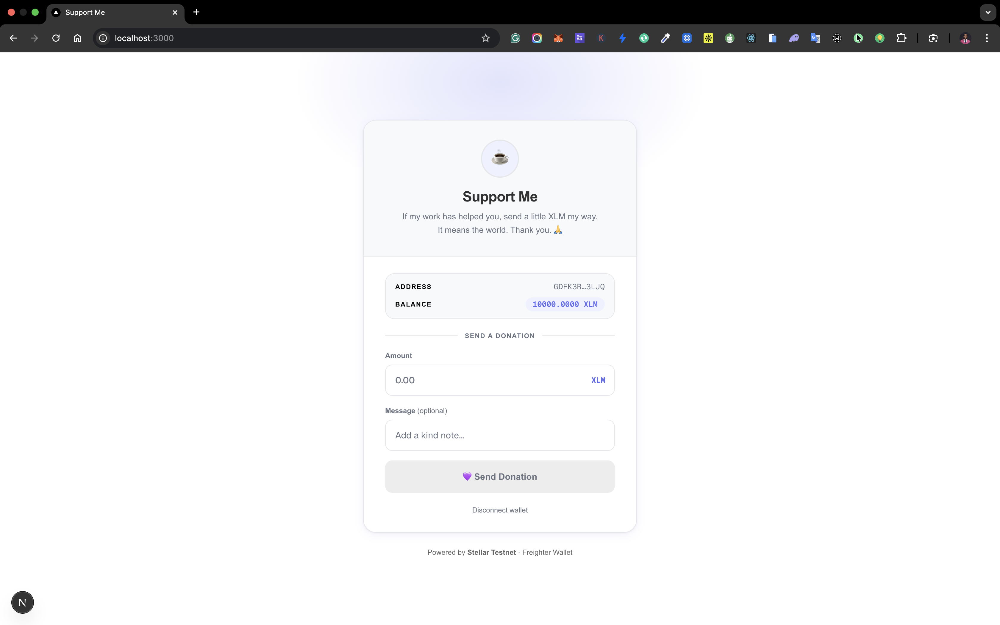
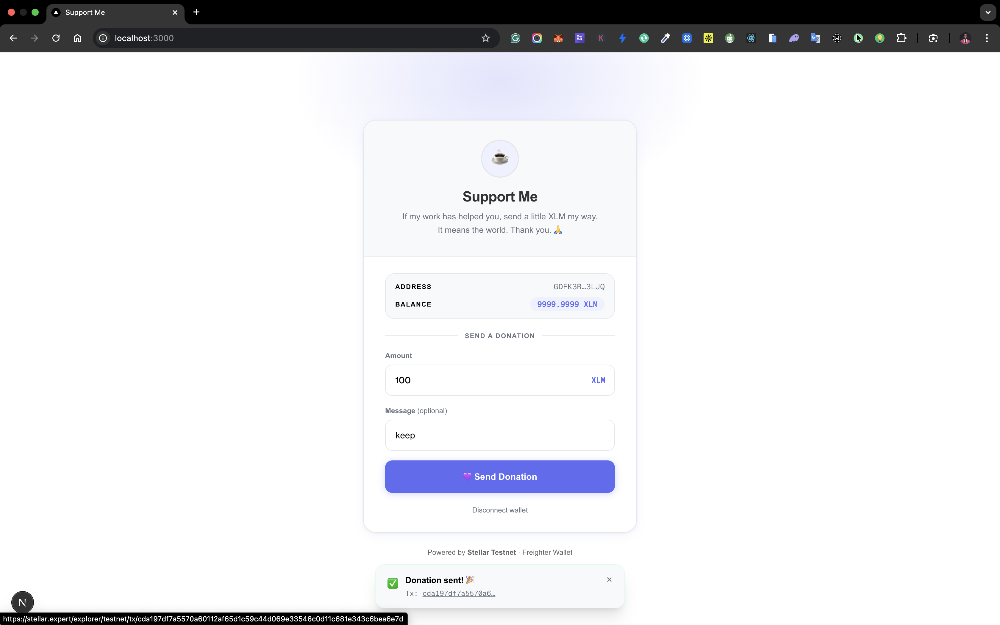

# SupportMe

A static, shareable donation page built on the Stellar blockchain testnet. Allow individuals to receive XLM tips from supporters via a public URL. 

## Screenshot




## Features

- **Wallet Integration**: Connect Freighter wallet for seamless donations
- **Real-time Feedback**: Transaction success/failure notifications with hashes
- **Dashboard**: Track incoming donations (planned)
- **Stellar Testnet**: Safe, fast, low-cost transactions
- **Responsive Design**: Mobile-friendly UI with custom design tokens

## Tech Stack

- **Frontend**: Next.js 16, React 19, TypeScript, Tailwind CSS
- **Blockchain**: Stellar SDK, Soroban smart contracts
- **Wallet**: Freighter API
- **Backend**: None (static page)
- **Smart Contracts**: Rust (Soroban)

## Project Structure

```
.
├── contracts/              # Soroban smart contracts (Rust)
│   └── hello-world/        # Example contract
├── frontend/               # Next.js application
│   ├── app/                # Next.js app directory
│   ├── components/         # React components
│   ├── lib/                # Utility libraries
│   └── types/              # TypeScript types
├── PRD.md                  # Product Requirements Document
└── README.md               # This file
```

## Installation

### Prerequisites

- Node.js 18+
- Rust (for smart contracts)
- Freighter wallet extension

### Setup

1. **Clone the repository:**
   ```bash
   git clone <repository-url>
   cd support-me
   ```

2. **Install frontend dependencies:**
   ```bash
   cd frontend
   npm install
   ```

3. **Build smart contracts (optional):**
   ```bash
   cd ..
   cargo build --release
   ```

4. **Environment setup:**
   Create `.env.local` in `frontend/`:
   ```
   NEXT_PUBLIC_STELLAR_NETWORK=TESTNET
   NEXT_PUBLIC_HORIZON_URL=https://horizon-testnet.stellar.org
   NEXT_PUBLIC_NETWORK_PASSPHRASE=Test SDF Network ; September 2015
   ```

## Usage

### Development

1. **Start the development server:**
   ```bash
   cd frontend
   npm run dev
   ```

2. **Open [http://localhost:3000](http://localhost:3000)**

### Building for Production

```bash
cd frontend
npm run build
npm start
```

### Connecting Wallet

- Click "Connect Wallet" to link your Freighter wallet
- Ensure you're on Stellar Testnet
- Send donations with optional messages

## Design Tokens

| Token | Value |
|---|---|
| Primary Accent | `#6366F1` |
| Background | `#FFFFFF` |
| Card | `#F8F9FB` |
| Text | `#1F2937` |
| Border | `#E5E7EB` |

## Contributing

1. Fork the repository
2. Create a feature branch
3. Make your changes
4. Run tests and linting
5. Submit a pull request

