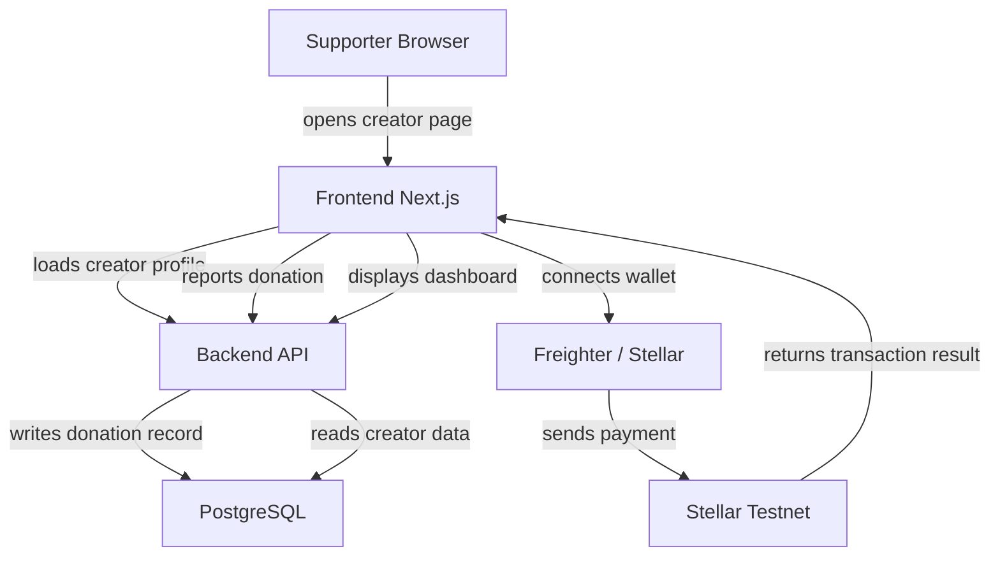

# SupportMe Architecture

SupportMe is designed as a modern web app with separate frontend and backend layers.
The current open source roadmap removes any required smart contract dependency and focuses on a backend-driven creator donation experience.

## Architecture Overview

- **Frontend**: `frontend/`
  - Next.js app for creator pages, wallet connection, and donation forms.
  - Provides a user interface for profile creation, supporter flow, and dashboard views.

- **Backend**: `backend/`
  - Node.js + Express API.
  - Uses Prisma for database access.
  - Stores creator profiles and donation records.

- **Database**: PostgreSQL
  - Stores creators, donations, and future metadata.
  - The backend is compatible with any PostgreSQL-compatible provider.

- **Wallet Integration**
  - Frontend uses Stellar/Freighter for wallet connections and payments.
  - The backend records transactions and creator metadata after payments.

- **Contracts**
  - Not required for the current MVP and open source contribution path.
  - The `contracts/` folder may remain as legacy examples but is not part of the current backend-first architecture.

## Flow Diagram

## Key Responsibilities

- **Frontend**
  - Display creator pages and donation forms
  - Manage wallet sessions and payment interactions
  - Send donation metadata to the backend after a successful transfer

- **Backend**
  - Store creator profile data
  - Record donation history
  - Provide endpoints for creator and donation queries
  - Serve as the integration point for future authentication and reporting

## Contribution Focus Areas

- Add creator authentication and session management
- Expand backend routes for goals, supporters, and reports
- Add pagination and filtering for dashboards
- Include payment reconciliation and webhook support
- Add tests and CI for backend and frontend changes
